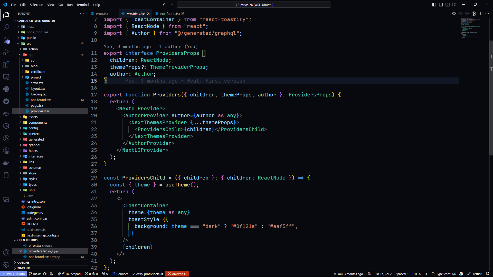

# codeslandia dark theme

> Este es una variante del tema dark de vscode con fondo más oscuro y colores más brillantes.

## Activar el tema

1. Abre la paleta de comandos de vscode con `Ctrl + Shift + P`
2. Escribe `Preferences: Color Theme`
3. Busca `codeslandia-dark-theme` y selecciónalo

## Capturas de pantalla

